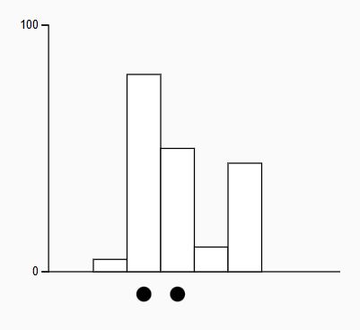
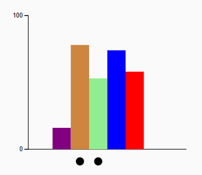

Link to experiment: https://hsmith1212.github.io/a3-experiment-theTeam/ 

# Overview: 

This project implements a controlled perceptual experiment inspired by Cleveland & McGill’s graphical perception research. Participants are asked to estimate what percentage the smaller marked value is of the larger marked value in a five-bar chart.

The goal of the experiment is to compare estimation accuracy across three different visual encoding conditions:
* Black & White (baseline)
* Multicolor bars
* Gradient-filled bars

Each participant completes 60 trials (20 per condition). Responses are graded using a logarithmic error metric to measure perceptual accuracy.

# Experiment Description:
Each trial:
* Displays 5 bars with one of the three colorings
* The 2nd and 3rd bars are marked
* Participants estimate: “What percentage is the smaller marked value of the larger?”

# Conditions Tested

Guiding Question: Does the different coloring of bars impact people’s ability to perceive differences in proportion? 

Bar Charts
* Black and White
   
* Gradient
  
* Multi Color
  

Trials are randomized across conditions for each participant.

# Grading & Error Metric:
Each response is evaluated using:

rawError = |reported − truePercentage|
log2Error = log2(rawError + 1/8)

If error = 0 → log2Error = 0
Log scaling stabilizes variance and matches the Cleveland & McGill methodology

Both raw error and log error are stored.

# Storing Results

Handles:

* Saving each trial to localStorage
* Preventing duplicate trial entries
* CSV export
* CSV download with timestamped filename

# Findings

### PUT IN GRAPH ###

Utilizing Excel, we built confidence intervals for the average log error in proportion perception for each visualization type. The confidence intervals are as follows:

* Black and White: [1.324811024, 1.664480427]
* Multicolor: [1.436461666, 1.756108452]
* Gradient: [1.340616113, 1.684139613]

We found, from our experiment, that participants’ ability to perceive differences in proportions of the bars was not impacted by the coloring condition of the bars. The confidence intervals for the log error of each condition heavily overlap, so we can not conclude that any of the coloring conditions improves or reduces people’s ability to perceive proportions of bars. 

# Technical Achievements:
* Built modular D3 visualization system: Designed a reusable D3 file (graph.js) that separates layout logic from styling, allowing multiple visualization conditions to share the same structure while varying only certain visual components.
* Implemented three different color conditions: Created Black & White, Multicolor, and Gradient bar chart conditions to isolate how different color encodings impact quantitative estimation accuracy.
* Implemented randomized controlled trial queue: Developed a shuffled trial system that mixes 3 conditions across 60 trials per participant to prevent order effects and learning bias.
* Implemented log-scaled error metric: Used a log₂-transformed error metric (based on Cleveland & McGill methodology) to stabilize variance and better compare perceptual accuracy across conditions.
* Built local storage mechanism: Participants were able to locally download their trial data after completing the experiment.
* Created automated CSV export and download: Developed CSV generation with labeled participant data and timestamped downloads for easy data collection and analysis.
* Built confidence interval summary visualization: Constructed a D3-based analysis view that displays mean log error and confidence intervals across conditions, enabling clear visual comparison of perceptual performance.

# Design Achievements: 
* Clean multi-screen UI (Intro → Trial → End)
* Clear visual marking of comparison bars
* Consistent axes across all conditions
* Randomized color order in the multicolor condition
* Gradient legend dynamically generated
* Input validation for participant responses
* For the results chart, added hover functionality. When your mouse is over a certain graph’s log error, a pop-up shows an example image of the graph.

# References:
* https://mimo.org/glossary/html/tooltip
* https://www.visualcinnamon.com/2016/05/smooth-color-legend-d3-svg-gradient/
* https://www.w3schools.com/colors/colors_names.asp
* https://coureywong.medium.com/how-to-shuffle-an-array-of-items-in-javascript-39b9efe4b567
* Utilized generative AI, specifically Claude, to help put together different modules and assist with syntax in getting experiment UI set-up.
